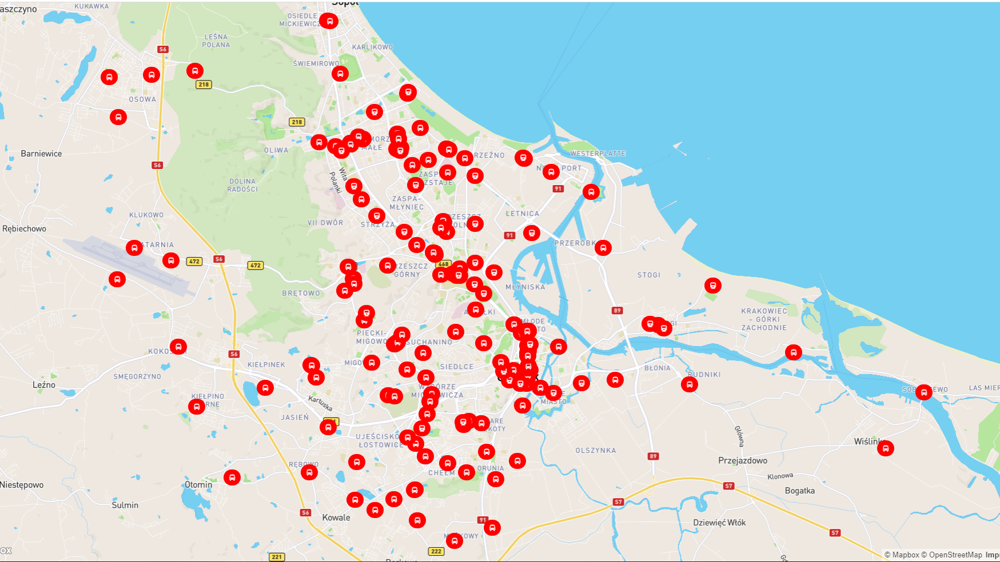

# GdanskWatchTraffic
>Simple React application that shows location of Gdansk's trams and buses. 
>Updates every 20 second.

## General info
Project to pass the class in Advanced Internet Technologies. We were supposed to make an application that uses some external Api. Some time ago i saw article about similiar app, so I decided to do something like it. With localisation data from server i can render a marker for each tram and bus

## Screenshots

## Technologies
React version 17.02

## Status
Project is: _finished_

## Project based on
* [React MapGl](https://github.com/visgl/react-map-gl)
* [Gdansk Api](https://www.gdansk.pl/otwarte-dane?show=data&id=tristar&s=byGroup&i=transport)
## Project inspired by
* [Article i mentioned earlier](https://www.trojmiasto.pl/wiadomosci/Po-naszym-artykule-stworzyl-strone-do-sledzenia-ruchu-tramwajow-n153669.html)
* [And direct link to app](https://tram-traffic-in-gdansk.netlify.app/)
## Contact
Created by Patryk Cieszyński
patrykciesz@gmail.com
